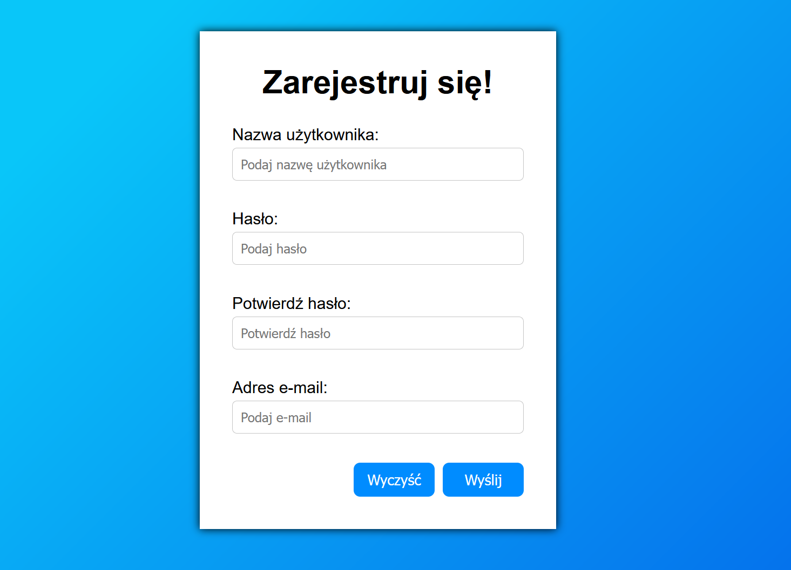

# UserRegister

    </img>

## Description

- Very small "one day made" app that is designed to register a user on a fictitious platform.
- All validation points are required.

#### Technology used:
- HTML, CSS, JS
- SCSS

## What I Learned

- Using vanilla JavaScript in building register checking validation app.
- Handling potential errors during register action.
- Checking validation for username, password and e-mail in accordance with the latest standards.

## Author info

- **Name:** Filip Bereszyński
- **Age:** 21 years old
- **Contact:**
    - bereszynski.filip@gmail.com
    - (+48) 510 240 074